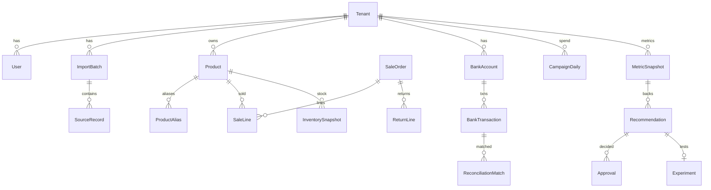

# Минимальная модель данных

Общие обязательные поля во всех доменных таблицах: `id`, `tenant_id` (NOT NULL, RLS), `created_at`, `updated_at`. В импортируемых данных дополнительно: `occurred_at` (бизнес-время, с TZ), `ingested_at`, `source_system`, `source_record_id`, `source_version`, `import_batch_id`, `status`. Деньги: `amount numeric(18,2)` + `currency char(3)`, `vat_included boolean`.

## Сущности

**Платформа:** Tenant, User, Role, UserRole, Connection (пока тип `file`), ImportBatch, SourceRecord, ColumnMapping, AuditEvent.

**Товар и продажи:** Product, ProductAlias (code, source_system → product_id), SaleOrder, SaleLine, ReturnLine, InventorySnapshot (product, warehouse, qty, as_of), InventoryMovement.

**Финансы:** AccountingEntry/Expense (closed-period данные бухгалтера), BankAccount, BankTransaction (txn_id, amount, currency, balance_after, counterparty_masked), ReconciliationMatch (left_type/left_id, right_type/right_id, method, confidence, status).

**Маркетинг:** CampaignDaily (platform, campaign_id, date, spend, impressions, clicks, attributed_orders), AttributionLink (order_id ↔ campaign, method, confidence, `is_causal=false` по умолчанию).

**Аналитика и AI:** MetricSnapshot (period, metric_key, value, formula_version, sources[]), Recommendation (type, inputs jsonb, formula_version, sources[], freshness, confidence, llm_model, llm_response_version, status), Approval (recommendation_id, user_id, decision, comment), Experiment (hypothesis, start/end, control, outcome), DocumentReview (фаза legal).

## Ключи уникальности (идемпотентность)
- `SourceRecord`: `(tenant_id, source_system, source_record_id)`.
- `ImportBatch`: `(tenant_id, file_sha256)` — повтор файла = no-op.
- `ProductAlias`: `(tenant_id, source_system, code)`.
- `BankTransaction`: `(tenant_id, bank_account_id, txn_id)`; если банк не даёт id — детерминированный hash (date, amount, balance_after, description).
- `CampaignDaily`: `(tenant_id, platform, campaign_id, date)` — ads-отчёты пересчитываются задним числом → upsert с `source_version`.

## Source of truth
| Факт | Источник истины |
|---|---|
| Операционное кол-во продаж по SKU | POS / ՀԾ-Առևտուր |
| Закрытая выручка и расходы | подтверждённая запись бухгалтера |
| Остаток на складе | складская система |
| Фактическое движение денег | банковская выписка |
| Рекламный расход | рекламная платформа |

Расхождения показываются, не перезаписываются.

## Проверки качества данных (checklist)
дубли документов; флаг возврата; один SKU под разными кодами; единицы измерения; timezone; НДС в/без; дата курса при мультивалюте; неполная пагинация (фаза API); разрывы периодов; поздняя финализация ads-данных; дата закрытия бухгалтерского периода; двойной счёт внутренних переводов между счетами клиента.

## ERD (Mermaid, упрощённо)

